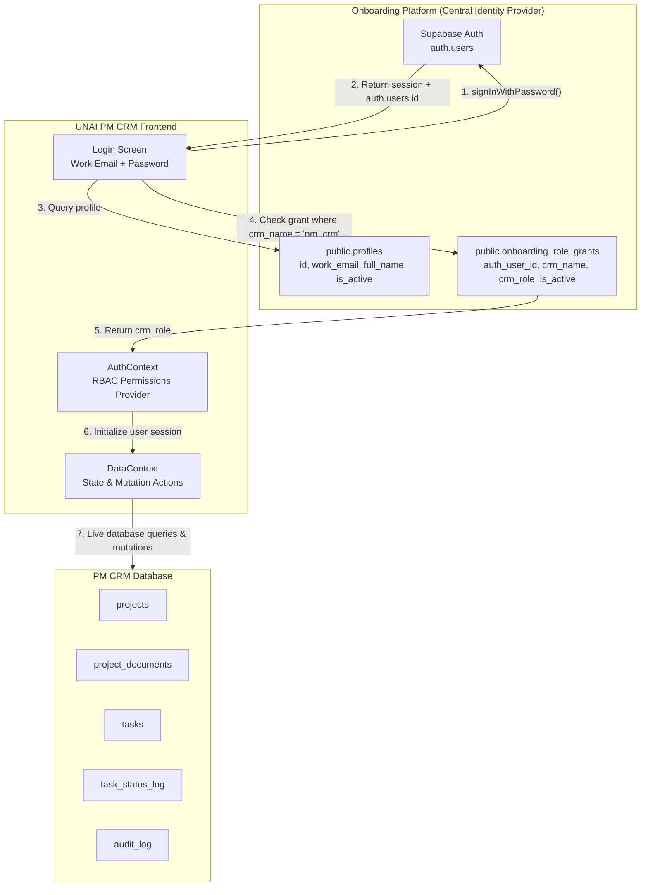
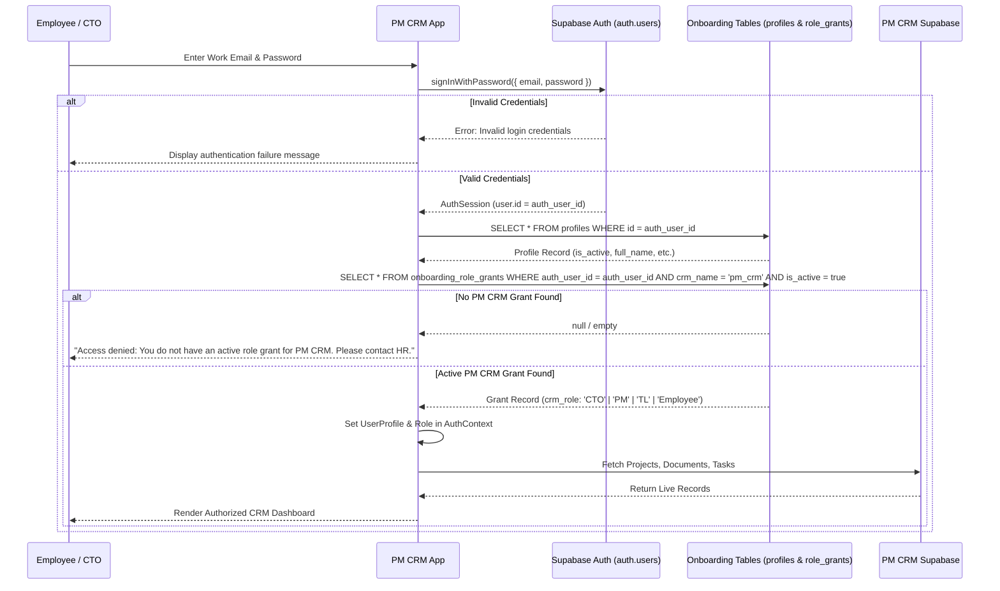

# UNAI PM CRM — System Architecture & Federated Authentication

This document details the architectural layout, authentication bridge, data flows, and security model of UNAI PM CRM.

---

## 1. Federated Authentication Architecture

UNAI PM CRM does not store work credentials or maintain a standalone user login database. Authentication is federated through the shared **UNAI Onboarding Platform**.

---

## 2. Authentication Sequence Flow

---

## 3. CRUD & RBAC Matrix (Section 3.2 Specification)

| Entity | CTO (Super Admin) | Project Manager (PM) | Team Lead (TL) | Employee |
|---|---|---|---|---|
| **Projects** | Full CRUD | Read (allocated) | Read (allocated) | Read (allocated) |
| **Project Members** | Full CRUD | Read | Read | Read |
| **Project Documents (16)** | Full CRUD | Update sections | Update sections | Read / Update sections |
| **Tasks** | Full CRUD | Delegate to TL/Dev | Delegate to Dev | Submit work on assigned tasks |
| **Task Verification** | Verify & Close / Reopen | Verify & Close / Reopen | Verify & Close / Reopen | Cannot verify |
| **Audit Ledger** | Full View & Export | Scoped View | Scoped View | Scoped View |
| **Document Export (.docx)** | One-click export all | One-click export all | Single doc export | Single doc export |
