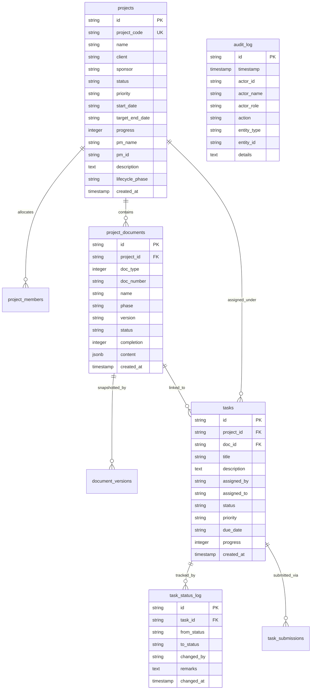

# UNAI PM CRM — Database & Schema Reference

This reference details the relational database schema, tables, properties, and constraints across both the **Onboarding Platform** and **PM CRM** databases.

---

## 1. Onboarding Platform Schema (Central Identity)

The Onboarding Platform defines user identity, profile details, and role grants across all CRMs.

### `public.profiles`
| Column | Type | Constraints | Description |
|---|---|---|---|
| `id` | UUID | PK, REFERENCES `auth.users(id)` | User authentication ID |
| `work_email` | TEXT | UNIQUE, NOT NULL | Employee work email address |
| `full_name` | TEXT | NOT NULL | Employee display name |
| `department` | TEXT | | Assigned department |
| `designation` | TEXT | | Employee title / designation |
| `employee_code` | TEXT | UNIQUE | Internal employee badge code |
| `is_active` | BOOLEAN | NOT NULL, DEFAULT true | Account status flag |
| `is_hr_admin` | BOOLEAN | NOT NULL, DEFAULT false | HR management permissions |

### `public.onboarding_role_grants`
| Column | Type | Constraints | Description |
|---|---|---|---|
| `id` | UUID | PK, DEFAULT `uuid_generate_v4()` | Grant ID |
| `auth_user_id` | UUID | NOT NULL | References `auth.users(id)` |
| `crm_name` | TEXT | CHECK (`hr_crm`, `finance_crm`, `pm_crm`) | Target CRM |
| `crm_role` | TEXT | NOT NULL | Assigned role (`CTO`, `PM`, `TL`, `Employee`) |
| `is_active` | BOOLEAN | NOT NULL, DEFAULT true | Grant status |

---

## 2. PM CRM Database Schema (Application Data)

The PM CRM database manages projects, digitized documents, task lifecycles, and audit logging.

