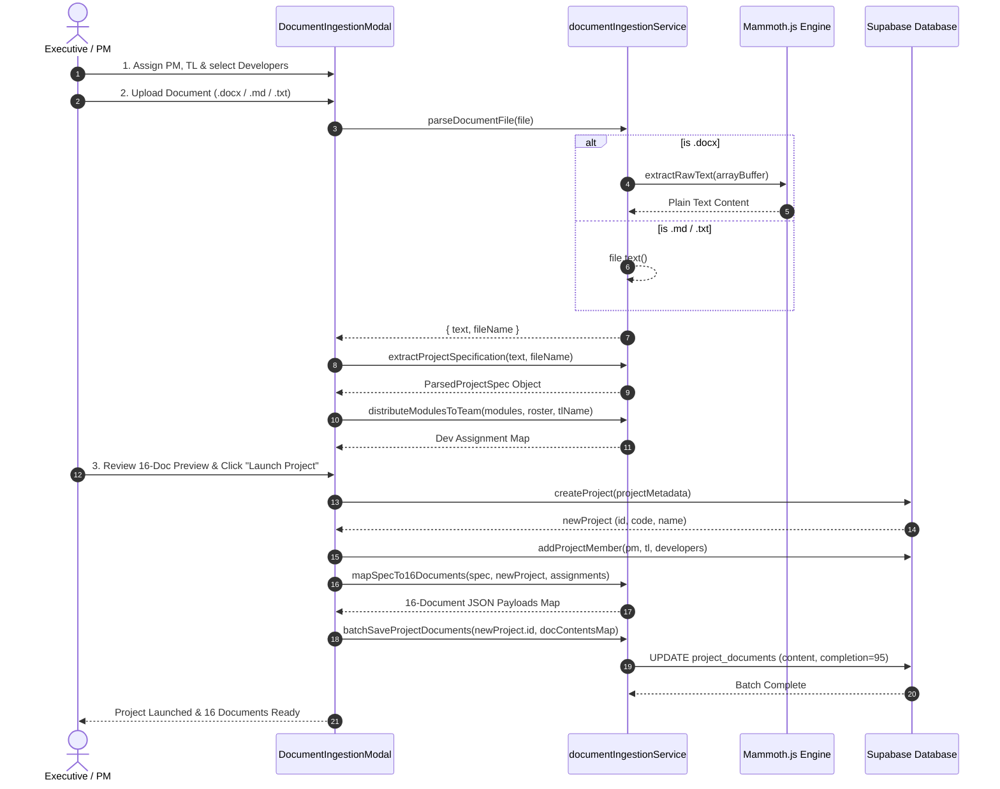
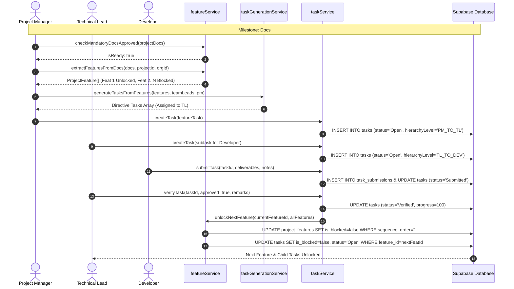

# UNAI PM CRM — Complete Technical Documentation: Document Ingestion, Multi-Document Splitting & Task Generation

This document provides a comprehensive technical reference for the **Document Ingestion Engine**, the **16-Document Multi-Split & Provisioning Pipeline**, the **Document Auto-Fill & Dependency Cascading System**, and the **Documentation-Driven Task Generation Engine** in the UNAI Project Management CRM.

---

## Table of Contents

1. [Architectural Overview](#1-architectural-overview)
2. [Document Upload & Ingestion Flow (`DocumentIngestionModal.tsx`)](#2-document-upload--ingestion-flow-documentingestionmodaltsx)
3. [Text Parsing & Section Extraction (`documentIngestionService.ts`)](#3-text-parsing--section-extraction-documentingestionservicets)
4. [Multi-Document Splitting Logic (Mapping Spec to 16 Documents)](#4-multi-document-splitting-logic-mapping-spec-to-16-documents)
5. [Database Persistence & Batch Provisioning](#5-database-persistence--batch-provisioning)
6. [Downstream Document Auto-Fill & Dependency Graph](#6-downstream-document-auto-fill--dependency-graph)
7. [Task Generation Engine (`taskGenerationService.ts` & `featureService.ts`)](#7-task-generation-engine-taskgenerationservicets--featureservicets)
8. [Workflow Engine & Domain Event Integration (`workflowEngine.ts`)](#8-workflow-engine--domain-event-integration-workflowenginets)
9. [Task Lifecycle: Delegation, Execution, Submission & Verification](#9-task-lifecycle-delegation-execution-submission--verification)
10. [End-to-End Execution Flowcharts & Sequence Diagrams](#10-end-to-end-execution-flowcharts--sequence-diagrams)
11. [Function Index & Reference Summary](#11-function-index--reference-summary)

---

## 1. Architectural Overview

The UNAI PM CRM is built around a **Single Source of Truth Document-Driven Governance Model**. Rather than manually filling out 16 distinct project lifecycle governance documents (from Project Charter to Post-Launch SLA), the system allows an executive or project manager to upload a single master scope or proposal document (`.docx`, `.md`, or `.txt`).

The platform extracts structured business, architectural, QA, and operational specifications from the uploaded file and **automatically provisions and populates all 16 standardized project governance documents simultaneously in Supabase**. It also distributes development work across the team, extracts features, and automatically generates verifiable engineering tasks.

```
┌─────────────────────────────────────────────────────────────────────────────┐
│                           MASTER SPECIFICATION FILE                         │
│                    (.docx Word Document / .md / .txt)                       │
└──────────────────────────────────────┬──────────────────────────────────────┘
                                       │
                                       ▼
┌─────────────────────────────────────────────────────────────────────────────┐
│                    DOCUMENT INGESTION SERVICE & PARSER                      │
│         - Mammoth.js raw text extraction (.docx array buffer)               │
│         - Regex pattern matching & section boundary extractors              │
│         - Module parsing & team round-robin distribution                    │
└──────────────────────────────────────┬──────────────────────────────────────┘
                                       │
                                       ▼
┌─────────────────────────────────────────────────────────────────────────────┐
│                     PARSED SPECIFICATION DATA STRUCTURE                     │
│                             (ParsedProjectSpec)                             │
└───────────────────┬─────────────────────────────────────┬───────────────────┘
                    │                                     │
                    ▼                                     ▼
┌──────────────────────────────────────┐┌─────────────────────────────────────┐
│   16-DOCUMENT SPLITTING & MAPPING    ││      PROJECT & TEAM PROVISIONING    │
│  - Doc 0:  Master Record             ││  - Supabase `projects` row         │
│  - Doc 1:  Project Charter           ││  - Supabase `project_members`      │
│  - Doc 2:  Project Management Plan   ││  - PM, TL, QA & Dev allocation     │
│  - Doc 3:  SRS (Requirements)        │└──────────────────┬──────────────────┘
│  - Doc 4:  BRD (Business Rules)      │                   │
│  - Doc 5:  Functional Spec (FDS)     │                   │
│  - Doc 6:  Technical Spec (TDS)      │                   │
│  - Doc 7:  System Architecture (ARCH)│                   │
│  - Doc 8:  UI/UX Design Spec         │                   │
│  - Doc 9:  Sprint Execution Backlog  │                   │
│  - Doc 10: System Test Plan & QA     │                   │
│  - Doc 11: Comprehensive Test Cases  │                   │
│  - Doc 12: Client UAT Sign-off       │                   │
│  - Doc 13: Deployment Checklist      │                   │
│  - Doc 14: Go-Live Certification     │                   │
│  - Doc 15: Post-Launch SLA Plan      │                   │
└──────────────────┬───────────────────┘                   │
                   │                                       │
                   ▼                                       │
┌──────────────────────────────────────────────────────────┴──────────────────┐
│               BATCH PROVISIONING INTO SUPABASE (`project_documents`)        │
└──────────────────────────────────────┬──────────────────────────────────────┘
                                       │
                                       ▼
┌─────────────────────────────────────────────────────────────────────────────┐
│              DOCUMENT APPROVAL GATE & FEATURE/TASK SYNTHESIS                │
│  - Gate: Approval of Docs #5 (FDS), #6 (TDS), #7 (ARCH), #8 (UI/UX)         │
│  - `featureService.extractFeaturesFromDocs`: Multi-Doc Feature Synthesis    │
│  - `taskGenerationService.generateTasksFromFeatures`: Directives to TLs     │
│  - Sequential Unlocking: Feature 1 Unlocked ➔ Feature 2..N Blocked          │
│  - TL Delegation ➔ Subtasks to Developers ➔ Live Time Tracking              │
│  - Submission ➔ Verification ➔ Next Feature & Task Unlocked                 │
└─────────────────────────────────────────────────────────────────────────────┘
```

---

## 2. Document Upload & Ingestion Flow (`DocumentIngestionModal.tsx`)

The document ingestion UI is orchestrated via a 3-step wizard in `src/components/modals/DocumentIngestionModal.tsx`.

### Step 1: Team & Roles Setup (`step === 1`)
Before processing the document, the user configures the project leadership and team roster:
1. **Leadership Assignment**:
   - **Project Manager (PM)**: Selected from organization members. Handled by `handlePmChange(name)`.
   - **Technical Lead (TL)**: Selected from organization members. Handled by `handleTlChange(name)`.
   - **QA Lead (QA)**: Selected from organization members. Handled by `handleQaChange(name)`.
2. **Employee Roster Filtering (`employeeMembers` memo)**:
   - Filters out any members holding leadership roles (`'CEO' | 'MD' | 'COO' | 'CTO' | 'CIO' | 'PM' | 'TL'`) or leadership titles in their designation.
   - Prevents duplicate selection of the assigned PM and TL.
   - Allows multi-select toggling (`handleToggleMember`) or batch selection (`handleSelectAllMembers`).

### Step 2: Ingest Document (`step === 2`)
Allows the user to upload or paste project specifications:
- **File Upload (`activeInputTab === 'upload'`)**:
  - File picker (`handleFileChange`) or Drag-and-Drop zone (`handleDrop`).
  - Supported formats: `.docx` (Microsoft Word), `.md` (Markdown), `.txt` (Plain text).
- **Direct Paste (`activeInputTab === 'paste'`)**:
  - Large text area for pasting raw scope text.
- **Reference Template Download**:
  - `documentIngestionService.downloadReferenceDocument('docx' | 'md')` generates a standard formatted specification template matching the ingestion schema.
- **Trigger**: User clicks **"Analyze & Extract Specifications"**, invoking `handleAnalyzeAndExtractWithTeam()`.

### Step 3: Extract & Launch (`step === 3`)
- Displays extracted project metadata (Name, Code, Budget, Client, Timeline, Modules).
- Previews the auto-generated content for all 16 documents via `previewDocId` tabs.
- Displays the module-to-developer distribution matrix (`assignments.devAssignments`).
- **Trigger**: User clicks **"Launch Project & Provision All Documents"**, invoking `handleLaunchProject()`.

---

## 3. Text Parsing & Section Extraction (`documentIngestionService.ts`)

File: `src/services/documentIngestionService.ts`

### 3.1 `parseDocumentFile(file: File)`
Extracts raw text content from the uploaded browser `File` object:
- **For `.docx`**: Uses `mammoth.extractRawText({ arrayBuffer })` to parse the OpenXML Word package into unformatted plain text.
- **For `.md` / `.txt`**: Uses standard browser `file.text()` API.
- **Returns**: `{ text: string, fileName: string }`.

### 3.2 `extractProjectSpecification(rawText: string, defaultFileName: string)`
Transforms unformatted raw text into a strongly typed `ParsedProjectSpec` object.

```typescript
export interface ParsedProjectSpec {
  name: string;
  code: string;
  client: string;
  sponsor: string;
  department: string;
  priority: 'High' | 'Medium' | 'Low';
  startDate: string;
  targetEndDate: string;
  budget: string;
  description: string;
  businessObjective: string;
  successCriteria: string;
  inScopeItems: string[];
  outOfScopeItems: string[];
  assumptions: string[];
  modules: ParsedModule[];
  techStack: {
    frontend: string;
    backend: string;
    database: string;
    cloud: string;
    integrations: string;
    security: string;
  };
  designSystem: {
    primaryColor: string;
    typography: string;
    screens: string[];
  };
  milestones: ParsedMilestone[];
  qaStrategy: {
    scope: string;
    acceptanceCriteria: string;
    uatDays: string;
  };
  deployment: {
    pipeline: string;
    environment: string;
    rollback: string;
    sla: string;
  };
  rawText: string;
}
```

#### Parsing Sub-Functions & Extraction Logic:

1. **Text Normalization (`cleanStr`)**:
   - Strips markdown formatting (`**`, `__`, `` ` ``), leading bullet symbols (`•`, `-`, `*`, `⁃`, `▪`), and extra whitespace.

2. **Key-Value Extraction (`findValue(regex, fallback)`)**:
   - Scans normalized lines for key-value pairs like `Project Name: ACME CRM` or `Budget: ₹25,00,000`.

3. **Section Delimiter Extraction (`getSectionText(startPattern, endPattern)`)**:
   - Collects lines bounded between regex start and end patterns (e.g. from `## 2. SCOPE OF WORK` to `## 3. TECHNICAL STACK`).

4. **Module & Scope Parser**:
   - Scans in-scope text lines.
   - Extracts module names and descriptions using pattern detection:
     - Pattern A: `**Module Name:** Description` or `**Module Name** — Description`
     - Pattern B: `Module Name: Description` or `Module Name — Description`
   - Handles multi-line continuation for detailed bullet descriptions.
   - If no modules are found, supplies enterprise fallback modules.

5. **Technical Stack & Architecture Parser**:
   - Extracts `frontend`, `backend`, `database`, `cloud`, `integrations`, and `security` configs.

6. **Design System & Milestone Parser**:
   - Extracts color palettes, typography scale, responsive grid specifications.
   - Parses milestone dates, deliverables, and lifecycle phase names into `ParsedMilestone[]`.

### 3.3 `distributeModulesToTeam(modules, selectedMembers, tlName)`
Automatically performs round-robin work distribution across assigned engineers:
- Filters `selectedMembers` to select developers/engineers (excluding PM and CTO).
- Iterates over `modules` and maps each module to an assigned engineer: `devMap[module.name] = { memberId, memberName }`.

---

## 4. Multi-Document Splitting Logic (Mapping Spec to 16 Documents)

The function `mapSpecTo16Documents(spec, projectMetadata, assignments)` in `documentIngestionService.ts` takes the parsed specification and maps it into the exact JSON content payload for all 16 lifecycle governance documents (Templates 0 through 15).

```
ParsedProjectSpec
       │
       ├──▶ Doc 0  (Master Record)                ──▶ High-level registry & phase gates
       ├──▶ Doc 1  (Project Charter)              ──▶ Business case, stakeholders & charter
       ├──▶ Doc 2  (Project Management Plan)      ──▶ WBS, roster & risk logs
       ├──▶ Doc 3  (SRS)                          ──▶ System interfaces, functional reqs & RTM
       ├──▶ Doc 4  (BRD)                          ──▶ As-Is vs To-Be, ROI & business rules
       ├──▶ Doc 5  (Functional Spec - FDS)        ──▶ Use cases & user stories
       ├──▶ Doc 6  (Technical Spec - TDS)         ──▶ API tables & database schemas
       ├──▶ Doc 7  (Architecture - ARCH)          ──▶ Topology, scaling, caching & patterns
       ├──▶ Doc 8  (UI/UX Design Spec)            ──▶ Wireframes, color palette & tokens
       ├──▶ Doc 9  (Sprint Backlog & Plan)        ──▶ Sprint tasks, velocity & capacity
       ├──▶ Doc 10 (System Test Plan & QA)        ──▶ Test objectives & exit criteria
       ├──▶ Doc 11 (Comprehensive Test Cases)     ──▶ Matrix of test scenarios & results
       ├──▶ Doc 12 (UAT Sign-off)                 ──▶ Client acceptance test scenarios
       ├──▶ Doc 13 (Deployment Checklist)         ──▶ Pre-flight checks & runbook steps
       ├──▶ Doc 14 (Go-Live Certification)        ──▶ Cutover schedule & go-live gates
       └──▶ Doc 15 (Post-Launch SLA Plan)         ──▶ Escalation matrix & support tiers
```

### Detailed Template Field Mapping Breakdown:

| Doc ID | Document Name | Extracted Fields & Generated Structure |
|---|---|---|
| **0** | **Master Record** | `project_name`, `project_code`, `client_sponsor`, `executive_summary`, `milestones_table` (mapped from `spec.milestones`), `risk_classification: 'Moderate'`, `cto_approval: 'Pending Review'` |
| **1** | **Project Charter** | `project_title`, `project_code`, `business_need`, `project_purpose`, `business_objectives`, `success_criteria`, `in_scope`, `out_of_scope`, `initial_budget`, `key_stakeholders_table` (client, sponsor, PM, TL, QA, team roster), `high_level_milestones_table` |
| **2** | **Project Management Plan (PMP)** | `plan_summary`, `project_methodology: 'Agile Scrum'`, `wbs_table` (each module mapped as WBS item with assigned developer), `schedule_baseline`, `sprint_cadence`, `team_roster_table`, `risk_log_table` |
| **3** | **System Requirements Specification (SRS)** | `system_purpose`, `system_scope`, `definitions_acronyms`, `product_perspective`, `functional_reqs_table` (REQ-01..N from modules), `software_interfaces` (tech stack), `performance_reqs`, `security_reqs`, `rtm_table` (Requirements Traceability Matrix) |
| **4** | **Business Requirements Document (BRD)** | `problem_statement`, `business_goals`, `desired_outcomes`, `as_is_process`, `to_be_process`, `business_reqs_table` (BRD-01..N), `cost_benefit_analysis` |
| **5** | **Functional Requirements Specification (FDS)** | `functional_summary`, `module_architecture`, `use_cases_table` (UC-01..N with preconditions, main flow, postconditions), `user_stories_table` (US-01..N with story points & acceptance criteria), `business_rules` |
| **6** | **Technical Specification Document (TDS)** | `frontend_framework`, `backend_framework`, `database_engine`, `cloud_infrastructure`, `third_party_services`, `database_schema_notes`, `api_endpoints_table` (REST routes for each module), `auth_flow`, `encryption_standards`, `rbac_rules` |
| **7** | **System Architecture Document (ARCH)** | `architectural_style`, `design_patterns`, `key_tradeoffs`, `topology_diagram_notes`, `scaling_strategy`, `caching_strategy`, `failover_dr_plan` |
| **8** | **UI/UX Design Specification** | `color_palette_notes`, `typography_scale`, `component_library`, `dark_mode_specs`, `screen_inventory_table` (SCR-01..N for each module screen), `wcag_compliance_level` |
| **9** | **Sprint Backlog & Execution Plan** | `sprint_number: 'Sprint 1'`, `sprint_goal`, `start_date`, `end_date`, `total_velocity`, `sprint_tasks_table` (TSK-01..N mapped with assigned developers and story points), `developer_capacity_table`, `dod_checklist` |
| **10** | **System Test Plan & QA Strategy** | `test_objectives`, `in_scope_testing`, `out_of_scope_testing`, `test_environment_url`, `test_tools_frameworks`, `test_exit_criteria` |
| **11** | **Comprehensive Test Cases Matrix** | `total_cases`, `passed_cases`, `test_cases_table` (TC-01..N per module with steps, expected result, actual result, QA lead assignee) |
| **12** | **User Acceptance Testing (UAT) Sign-off** | `uat_period`, `client_testers_table` (client signatory), `uat_scenarios_table` (UAT-01..N per module), `formal_client_acceptance`, `client_signature_name` |
| **13** | **Deployment & Operations Checklist** | `release_version`, `target_environment`, `rollback_procedure`, `pre_deploy_table` (CHK-01..03), `runbook_steps_table` (build, deploy, smoke tests) |
| **14** | **Go-Live Certification & Cutover Plan** | `go_live_criteria_table` (Build Gate, QA Gate, UAT Gate), `cutover_schedule_table` (T-02:00, T-00:00, T+01:00), `decision: 'GO'`, `justification_remarks` |
| **15** | **Post-Launch Maintenance & SLA Agreement** | `support_tier`, `response_time_sla`, `resolution_time_sla`, `support_hours`, `escalation_table` (Tier 1 Support Desk, Tier 2 TL, Tier 3 CTO) |

---

## 5. Database Persistence & Batch Provisioning

When the user launches the project in `DocumentIngestionModal.tsx`:

```typescript
// 1. Create project in Supabase
const newProject = await createProject({
  name: spec.name,
  code: spec.code,
  client: spec.client,
  sponsor: spec.sponsor,
  department: spec.department,
  priority: spec.priority,
  status: 'Planning',
  startDate: spec.startDate,
  targetEndDate: spec.targetEndDate,
  budget: parseInt(spec.budget.replace(/[^0-9]/g, ''), 10) || 2500000,
  description: spec.description,
  pmName: assignments.pmName || 'PM',
  technology: spec.techStack.frontend + ' / ' + spec.techStack.backend,
  businessObjective: spec.businessObjective,
});

// 2. Provision all assigned team members into `project_members`
// 3. Map parsed spec to all 16 document content payloads
const all16DocsContent = documentIngestionService.mapSpecTo16Documents(
  spec,
  newProject,
  assignments
);

// 4. Batch update `project_documents` in Supabase
await documentIngestionService.batchSaveProjectDocuments(
  newProject.id,
  all16DocsContent
);
```

### `batchSaveProjectDocuments(projectId, docContentsMap)`:
1. Queries the `project_documents` table for all seeded document rows matching `project_id`.
2. Matches each document record's `doc_type` (0 to 15) with `docContentsMap[doc_type]`.
3. Sets `content = docContentsMap[doc_type]` and `completion = 95`.
4. Executes updates across all 16 documents in parallel via `Promise.all()`.

---

## 6. Downstream Document Auto-Fill & Dependency Graph

Even after initial ingestion, documents evolve through their lifecycle. The CRM enforces a Directed Acyclic Graph (DAG) for sequential approvals and cascading data auto-fill.

### 6.1 Dependency DAG (`documentDependencyGraph.ts`)

```
01 Project Charter (CTO)
  └──▶ 02 Project Plan (CTO/PM)
        └──▶ 03 SRS (PM)
              └──▶ 04 BRD (CTO)
                    ├──▶ 05 Functional Spec (FDS) (PM/TL)
                    ├──▶ 06 Technical Spec (TDS) (PM/TL)
                    ├──▶ 07 Architecture Doc (ARCH) (PM/TL)
                    └──▶ 08 UI/UX Design Doc (PM/TL)
                          └──▶ 09 Sprint Plan (Auto-fill)
                                ├──▶ 10 Test Plan (QA Lead)
                                ├──▶ 11 Test Cases (QA/Dev)
                                └──▶ [Tasks from 05-08 ➔ TL ➔ Dev]
                                      └──▶ 12 UAT Sign-off
                                            └──▶ 13 Deployment Checklist
                                                  └──▶ 14 Go-Live Checklist
                                                        └──▶ 15 Maintenance Plan
```

### 6.2 Auto-Fill Cascade Functions (`documentAutoFillService.ts`)

- **`getAutoFilledFields(templateId, projectDocuments)`**:
  - Checks if required upstream documents are `status === 'Approved'`.
  - Maps upstream fields into the current document based on `DOCUMENT_DEPENDENCY_GRAPH[templateId].autoFillMappings`.
- **`mergeWithExisting(existingContent, autoFilledContent)`**:
  - Merges auto-filled fields while preserving any custom manual modifications made by the user.
- **`getSprintPlanAutoFill(projectTeamMembers, projectDocuments, project, features, tasks)`**:
  - Calls `sprintAutoFillService.generateSprintPlanContent()` to dynamically synthesize the Sprint Plan (Doc 9) from active features, tasks, logged hours, and developer capacities.

---

## 7. Task Generation Engine (`taskGenerationService.ts` & `featureService.ts`)

Tasks in the UNAI PM CRM are generated through two distinct mechanisms:
1. **Module Distribution during Ingestion**: Extracted modules are converted into WBS items (Doc 2) and Sprint Tasks (Doc 9) assigned directly to engineers.
2. **Feature Architecture & Spec Synthesis**: Approved design documentation (Docs 5, 6, 7, 8) is synthesized into structured `ProjectFeature` records and delegated tasks.

```
┌─────────────────────────────────────────────────────────────────────────────┐
│                       APPROVED DOCUMENTATION SYNTHESIS                      │
│                                                                             │
│   Doc 7 (Architecture) ──▶ Components Table ──▶ Features (Parent Units)     │
│   Doc 5 (Functional)   ──▶ Functional Reqs  ──▶ Linked Functions            │
│   Doc 6 (Technical)    ──▶ API Endpoints    ──▶ Linked REST APIs            │
│   Doc 8 (UI/UX Design) ──▶ Screens Table    ──▶ Linked Wireframes           │
└──────────────────────────────────────┬──────────────────────────────────────┘
                                       │
                                       ▼
┌─────────────────────────────────────────────────────────────────────────────┐
│                    `featureService.extractFeaturesFromDocs`                 │
│         - Synthesizes 4 docs into structured `ProjectFeature[]`             │
│         - Sets Feature 1: `isBlocked = false`, `status = 'Pending'`         │
│         - Sets Features 2..N: `isBlocked = true`, `status = 'Blocked'`      │
└──────────────────────────────────────┬──────────────────────────────────────┘
                                       │
                                       ▼
┌─────────────────────────────────────────────────────────────────────────────┐
│               `taskGenerationService.generateTasksFromFeatures`             │
│   - Creates Primary Directive Task for each Feature (assigned to TL)        │
│   - Embedded Specs: Functions list, APIs to build, Screens to design        │
│   - Hierarchy: `hierarchyLevel = 'PM_TO_TL'`, `taskType = 'feature_task'`   │
└──────────────────────────────────────┬──────────────────────────────────────┘
                                       │
                                       ▼
┌─────────────────────────────────────────────────────────────────────────────┐
│                        TEAM LEAD DELEGATION TO DEVELOPERS                   │
│   - TL creates Child Subtasks (`hierarchyLevel = 'TL_TO_DEV'`)              │
│   - Developer starts task ➔ Live Time Tracking (Work / Break intervals)     │
│   - Developer completes work ➔ Attaches deliverables & Submits              │
│   - Supervisor Verifies ➔ `unlockNextFeature` triggers next Feature in line │
└─────────────────────────────────────────────────────────────────────────────┘
```

### 7.1 Feature Synthesis (`featureService.extractFeaturesFromDocs`)
File: `src/services/featureService.ts`

When Docs 5, 6, 7, and 8 are approved:
1. **Extracts Architecture Components** from Doc 7 (`components_table`): Each component becomes a `ProjectFeature`.
2. **Correlates Functional Specifications** from Doc 5 (`func_reqs_table`): Injected into `feature.linkedFunctions`.
3. **Correlates API Routes** from Doc 6 (`api_table`): Injected into `feature.linkedApis`.
4. **Correlates UI Screens** from Doc 8 (`screens_table`): Injected into `feature.linkedScreens`.
5. **Enforces Sequential Pacing**:
   - Feature 1 is unlocked (`isBlocked = false`, `status = 'Pending'`).
   - Features 2 through N are locked (`isBlocked = true`, `status = 'Blocked'`).

### 7.2 Generating Directive Tasks (`taskGenerationService.generateTasksFromFeatures`)
File: `src/services/taskGenerationService.ts`

Converts each `ProjectFeature` into an actionable task:
- **Title**: `[Feature {sequenceOrder}] {feature.name}`
- **Description**: Contains full feature details, tech stack, and concatenated list of linked functions, APIs, and screens.
- **Hierarchy Level**: `'PM_TO_TL'` (assigned by PM to Team Lead).
- **Status**: `'Open'` if feature is unblocked; `'Blocked'` if blocked.
- **Estimated Hours**: Defaults to 40 hours per feature module.

### 7.3 Direct Document Task Generation (`taskGenerationService.generateTasksFromDocument`)
Generates tasks directly from specific content fields when a document is approved:
- **Doc 5 (FDS)**: Generates `FDS-01..N` tasks for User Flows and Validation Rules.
- **Doc 6 (TDS)**: Generates `TDS-01..N` tasks for API Endpoints and Database Schema.
- **Doc 7 (ARCH)**: Generates `ARCH-01..N` tasks for Infrastructure and Caching/Event Pipelines.
- **Doc 8 (UI/UX)**: Generates `UIUX-01..N` tasks for Figma URLs and Design System Tokens.

---

## 8. Workflow Engine & Domain Event Integration (`workflowEngine.ts`)

File: `src/services/workflowEngine.ts`

The CRM includes an event-driven workflow engine that processes domain events and enforces idempotency.

### Key Domain Events:
- `DOCUMENT_APPROVED`: Triggered when an executive signs off on a document. Triggers auto-fill cascading and task generation rules.
- `TASK_VERIFIED`: Triggered when a supervisor verifies deliverables. Triggers `featureService.unlockNextFeature()`.
- `FEATURE_CREATED`, `SPRINT_CREATED`, `PROJECT_CLOSED`.

### Idempotency & Execution Pipeline:
1. `generateExecutionKey(event, ruleId)`: Generates a unique key (`eventType:projectId:entityId:versionId:ruleId`).
2. `hasBeenExecuted(executionKey)`: Checks `workflow_executions` table to prevent duplicate actions.
3. `executeAction(rule, event)`: Dispatches `CREATE_TASK`, `CREATE_FEATURE`, `UPDATE_STATUS`, or `CREATE_SNAPSHOT`.
4. `recordExecution(...)`: Inserts execution result into `workflow_executions`.
5. `safeLogWorkflowAuditEvent(...)`: Records an immutable audit log entry in `audit_log`.

---

## 9. Task Lifecycle: Delegation, Execution, Submission & Verification

```
┌──────────────┐      PM Assigns       ┌──────────────┐      TL Delegates      ┌──────────────┐
│  CTO / Admin │ ────────────────────▶ │  Team Lead   │ ─────────────────────▶ │  Developer   │
└──────────────┘                       └──────────────┘                        └──────┬───────┘
                                                                                      │
                                                                           Starts Work & Tracks Time
                                                                                      │
                                                                                      ▼
┌──────────────┐                       ┌──────────────┐    Submits Deliverables ┌──────────────┐
│ Next Feature │ ◀──────────────────── │ Supervisor   │ ◀────────────────────── │  Submitted   │
│   Unlocked   │   Verified & Closed   │ Verification │   (Files, URLs, Notes)  │    State     │
└──────────────┘                       └──────┬───────┘                        └──────────────┘
                                              │
                                     Changes Requested
                                              │
                                              ▼
                                       ┌──────────────┐
                                       │   Reopened   │
                                       └──────────────┘
```

### 1. Task Delegation Chain (`TaskAssignmentModal.tsx`)
- **CTO ➔ PM**: Strategic project directives (`hierarchyLevel = 'CTO_TO_PM'`).
- **PM ➔ TL**: Feature directive tasks (`hierarchyLevel = 'PM_TO_TL'`).
- **TL ➔ Developer/QA**: Code implementation and testing subtasks (`hierarchyLevel = 'TL_TO_DEV'`).

### 2. Time Tracking (`timeTrackingService.ts`)
- Developers log live intervals (`START_WORK`, `PAUSE_BREAK`, `RESUME_WORK`, `STOP_WORK`).
- Computes `totalWorkMinutes`, `totalBreakMinutes`, `actualHours`, and overtime indicators stored in `task_time_logs`.

### 3. Task Submission (`taskService.submitTask`)
- Assignee uploads deliverables: notes, file attachments, and pull request/staging URLs.
- Inserts record into `task_submissions`.
- Records status transition in `task_status_log` (`to_status = 'Submitted'`).
- Emits task event via `taskEventService.recordTaskEvent`.
- Sets task status to `'Submitted'` and progress to `85%`.

### 4. Supervisor Verification (`taskService.verifyTask`)
- Supervisor reviews deliverables and approves or requests changes.
- **If Approved**:
  - Status becomes `'Verified'`, progress reaches `100%`.
  - Records `verified_by`, `verified_by_name`, and `verified_at`.
  - Emits domain event `TASK_VERIFIED`.
  - Triggers `featureService.unlockNextFeature()`: Unblocks the next sequential feature (`is_blocked = false`) and unlocks its associated tasks.
- **If Changes Requested**:
  - Status becomes `'Reopened'`, progress drops to `30%`.
  - Developer receives supervisor feedback notes for revision.

---

## 10. End-to-End Execution Flowcharts & Sequence Diagrams

### Sequence Diagram: Document Upload to 16-Document Provisioning



---

### Sequence Diagram: Spec Synthesis to Task Verification & Feature Unlocking



---

## 11. Function Index & Reference Summary

| File | Function | Input Parameters | Return Value | Description |
|---|---|---|---|---|
| `documentIngestionService.ts` | `parseDocumentFile` | `file: File` | `Promise<{ text, fileName }>` | Reads `.docx` (via Mammoth.js) or `.md`/`.txt` into raw plain text. |
| `documentIngestionService.ts` | `extractProjectSpecification` | `rawText: string, defaultFileName: string` | `ParsedProjectSpec` | Extracts structured metadata, modules, tech stack, milestones, and QA specs. |
| `documentIngestionService.ts` | `distributeModulesToTeam` | `modules, selectedMembers, tlName` | `Record<string, { memberId, memberName }>` | Performs round-robin distribution of modules to developers. |
| `documentIngestionService.ts` | `mapSpecTo16Documents` | `spec, projectMetadata, assignments` | `Record<number, Record<string, any>>` | Maps parsed spec into exact JSON form dictionaries for all 16 templates. |
| `documentIngestionService.ts` | `batchSaveProjectDocuments` | `projectId, docContentsMap` | `Promise<void>` | Updates `content` and `completion` (95%) across all 16 `project_documents`. |
| `documentIngestionService.ts` | `downloadReferenceDocument` | `format: 'docx' \| 'md'` | `Promise<void>` | Generates and triggers browser download of standard reference specification template. |
| `documentDependencyGraph.ts` | `isDocumentEditable` | `templateId, userRole, projectDocs` | `{ editable: boolean, reason?, blockedBy? }` | Checks role authorization and prerequisite document approval gates. |
| `documentDependencyGraph.ts` | `getAutoFillContent` | `templateId, projectDocs` | `Record<string, any>` | Extracts mapped field values from approved upstream documents. |
| `documentAutoFillService.ts` | `getAutoFilledFields` | `templateId, projectDocs` | `{ autoFilledContent, sourceDocNames }` | Retrieves auto-fill data and source document attribution. |
| `documentAutoFillService.ts` | `mergeWithExisting` | `existingContent, autoFilledContent` | `Record<string, any>` | Merges auto-fill values while preserving user manual inputs. |
| `sprintAutoFillService.ts` | `generateSprintPlanContent` | `project, features, tasks, teamMembers` | `Record<string, any>` | Builds Sprint Backlog, Capacity, and Execution Timing tables for Doc #9. |
| `featureService.ts` | `checkMandatoryDocsApproved` | `projectDocs: ProjectDocument[]` | `{ isReady, missingDocs, unapprovedDocs }` | Verifies whether Docs #5, #6, #7, and #8 are marked `'Approved'`. |
| `featureService.ts` | `extractFeaturesFromDocs` | `projectDocs, projectId, orgId` | `ProjectFeature[]` | Synthesizes architecture, APIs, screens, and functions into sequential features. |
| `featureService.ts` | `unlockNextFeature` | `completedFeatureId, allFeatures` | `Promise<{ unlockedFeature, updatedFeatures }>` | Unblocks the next sequential feature and its child tasks upon supervisor verification. |
| `taskGenerationService.ts` | `generateTasksFromFeatures` | `features, projectName, teamLeads, pmUser, orgId` | `Omit<Task, 'createdAt'>[]` | Converts features into Primary Directive Tasks for Team Leads. |
| `taskGenerationService.ts` | `generateTasksFromDocument` | `document, projectName, teamMembers` | `GeneratedTask[]` | Generates specialized tasks from approved design document fields. |
| `taskService.ts` | `createTask` | `taskData, actorId, actorName, actorRole` | `Promise<Task>` | Creates a task in Supabase with foreign-key validation and reference file support. |
| `taskService.ts` | `submitTask` | `taskId, submission, actorId, actorName` | `Promise<Task>` | Submits task deliverables, logs transition, and sets status to `'Submitted'`. |
| `taskService.ts` | `verifyTask` | `taskId, approved, remarks, actorId, actorName` | `Promise<Task>` | Verifies deliverables, sets status to `'Verified'` or `'Reopened'`, and emits event. |
| `workflowEngine.ts` | `processEvent` | `event: DomainEvent` | `Promise<WorkflowResult>` | Processes domain events with idempotency verification against `workflow_executions`. |
