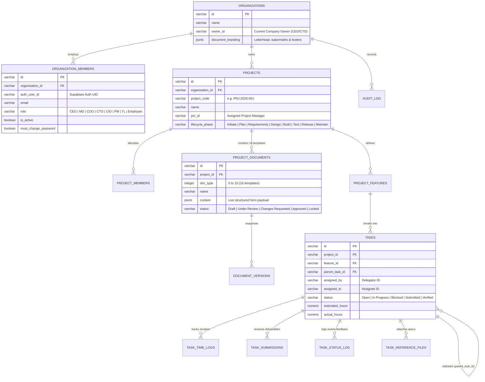

# UNAI PM CRM — Database Architecture, RBAC & Role-Based UI Flow Manual

---

## 1. Executive Summary & Purpose

The **UNAI Project Management CRM** is an enterprise project governance and execution platform built with **Electron (Desktop)**, **React 18 + Vite (SPA)**, and **Supabase (PostgreSQL 15)**.

This manual provides the technical reference and operational guide for:
1. **Database Architecture & Data Flow** across all 14 core tables and 30+ governance entities.
2. **Role-Based Access Control (RBAC) Governance Model** spanning 8 distinct corporate roles (`CEO`, `MD`, `COO`, `CTO`, `CIO`, `PM`, `TL`, `Employee`).
3. **Role-Scoped UI Navigation & Data Visibility**, ensuring zero exposure of unassigned data, unauthorized administrative pages, or restricted actions.
4. **Integration with Antigravity Skills Ecosystem (`@rmyndharis/antigravity-skills`)** for auditing, code quality, testing, security, and continuous delivery.

---

## 2. Database Architecture & Entity Relationships



---

## 3. Role Hierarchy & Permission Tiers

```
┌─────────────────────────────────────────────────────────────────────────────┐
│  Tier 1: Super Admin / Executives (CEO, MD, COO, CTO, CIO)                  │
│  - Full CRUD across all organizations, projects, staff, budgets, & audit    │
│  - Unrestricted view with dynamic role preview simulation (CEO/PM/TL/Dev)   │
└──────────────────────────────────────┬──────────────────────────────────────┘
                                       │
┌──────────────────────────────────────▼──────────────────────────────────────┐
│  Tier 2: Project Management Tier (PM)                                       │
│  - Project creation, planning, WBS breakdowns, and budget monitoring        │
│  - Feature creation & task delegation to Technical Leads (TLs)              │
│  - Document authoring, sign-off reviews, and CR impact analysis             │
└──────────────────────────────────────┬──────────────────────────────────────┘
                                       │
┌──────────────────────────────────────▼──────────────────────────────────────┐
│  Tier 3: Engineering Lead Tier (TL)                                         │
│  - Sprint execution board, subtask delegation to Developers & Interns       │
│  - Code review, submission inspection, and approval/reopen feedback loops   │
│  - Technical specification authoring & blocker reporting                    │
└──────────────────────────────────────┬──────────────────────────────────────┘
                                       │
┌──────────────────────────────────────▼──────────────────────────────────────┐
│  Tier 4: Execution / Contributor Tier (Employee, Developer, Intern)         │
│  - Individual "My Tasks" board with micro-timer (Start / Pause / Break)     │
│  - Deliverable submission with notes, file uploads, and repo links          │
│  - Read-only access to assigned project documentation                       │
└─────────────────────────────────────────────────────────────────────────────┘
```

---

## 4. UI Access & Page Guard Rails

### 4.1 Navigation Tab Access Matrix

| Nav Item | Icon | Executive Tier | Project Manager (PM) | Team Lead (TL) | Employee / Dev |
|:---|:---:|:---:|:---:|:---:|:---:|
| **Dashboard** | `LayoutDashboard` | Full Overview | Scoped Overview | Team Overview | Personal Overview |
| **Projects** | `FolderKanban` | All Projects (CRUD) | Assigned Projects | Assigned Projects | Assigned Projects |
| **Documents** | `FileText` | All 16 Templates | Assigned Projects | Assigned Projects | Assigned Projects |
| **Tasks** | `CheckSquare` | Full Org Board | Project Board | Team Board | **Hidden** |
| **My Tasks** | `CheckSquare` | Optional View | Optional View | Available | **Default Landing** |
| **Team** | `Users` | Org Directory | Project Team | Project Team | Project Team |
| **CR Approvals** | `GitPullRequest` | Final Authority | Project Scoped | Hidden | Hidden |
| **Reports** | `BarChart3` | Cross-Org BI | Project Reports | Team Reports | Hidden |
| **Audit Trail** | `ShieldCheck` | Immutable Log | **Hidden** | **Hidden** | **Hidden** |
| **Settings** | `Settings` | System Config | **Hidden** | **Hidden** | **Hidden** |

### 4.2 Client-Side Route Guards (`RouteGuard.tsx`)

Every protected view in `App.tsx` is wrapped in a `<RouteGuard>` component. If an unauthorized user attempts to open a restricted tab via manual memory injection or console scripts:
1. Navigation is intercepted.
2. The user is presented with the **UnauthorizedScreen** showing the exact required permission.
3. A safe fallback redirect button navigates them back to their permitted view.

---

## 5. Screen-by-Screen Action Matrix

### 5.1 Projects Registry (`ProjectsListScreen.tsx`)
- **Executive**: Create new projects, delete projects, edit project budgets, sponsors, and assign PMs.
- **PM**: Create new projects, edit assigned projects, manage project members.
- **TL / Employee**: View assigned projects only (read-only project hub).

### 5.2 16 Digitized Lifecycle Documents (`DocumentsScreen.tsx`, `DocumentEditScreen.tsx`)
- **Executive**: Author, edit, lock, unlock, approve, and export all 16 document templates.
- **PM**: Author and edit documents matching phase permissions (SRS, BRD, Charter, Project Plan, etc.).
- **TL**: Author technical architecture, API specs, and sprint plans.
- **Employee**: Read-only reference viewing of project specifications.

### 5.3 Task & Delegation Board (`TaskManagementScreen.tsx` vs `MyTasksScreen.tsx`)
- **Executive**: Full administrative override; can reassign or verify any task across the company.
- **PM**: Creates directives (`CTO_TO_PM`, `PM_TO_TL`) and assigns them to Technical Leads.
- **TL**: Breaks directives into subtasks (`TL_TO_DEV`) and assigns them to Developers.
- **Employee**: Uses `MyTasksScreen` to run the active timer (`Begin`, `Pause / Break`, `Resume`) and submits completed work for verification.

### 5.4 Change Request Governance (`CRApprovalInboxScreen.tsx`)
- **Executive**: Evaluates escalated CRs with budget/schedule impact; final sign-off authority.
- **PM**: Submits CR impact analysis and evaluates scope adjustments.
- **TL / Employee**: Notified if their active tasks are affected by an approved CR.

### 5.5 System Settings & User Management (`SettingsScreen.tsx`)
- **Restricted strictly to Executive roles (CEO, MD, COO, CTO, CIO)**.
- Functions include: Inviting new members, modifying staff designations/roles, editing custom watermarks/branding, and executing formal Company Ownership Transfer.

---

## 6. Antigravity Skills Ecosystem Mapping

The following skills from the installed `@rmyndharis/antigravity-skills` package are integrated into the maintenance and evolution of this platform:

| Skill | Category | Application in UNAI PM CRM |
|:---|:---|:---|
| `auth-implementation-patterns` | Security & Auth | Governs session lifecycles, PKCE authentication, and JWT role verification |
| `backend-security-coder` | Security | Verifies that Supabase RPC calls and service APIs enforce organization isolation |
| `database-architect` | Database | Maintained unified schema structure, indexing strategies, and foreign keys |
| `sql-pro` | Database | Crafted hardened RLS policies in `sql/013_rbac_rls_hardening.sql` |
| `frontend-developer` | UI/UX | Created `RouteGuard.tsx` and `UnauthorizedScreen.tsx` with Tailwind styling |
| `typescript-pro` | Type Safety | Enforced strictly-typed permission strings via `AppPermission` union types |
| `architect-review` | Architecture | Evaluated end-to-end data flow between Electron, React, and Supabase |
| `code-documentation-doc-generate` | Documentation | Formatted structured technical guides and architectural diagrams |
| `accessibility-compliance-accessibility-audit` | Quality | Audited keyboard navigation, ARIA attributes, and color contrast on UI guards |

---

## 7. Deployment & Verification Runbook

### Step 1: Apply SQL Hardening Migration
Run `sql/013_rbac_rls_hardening.sql` in the Supabase SQL Editor to enforce database-level policies.

### Step 2: Build Verification
Execute TypeScript check to confirm strict compilation:
```bash
npm run build
```

### Step 3: Role Flow Test Checkpoints
1. **Login as CEO / CTO**: Confirm full access to Settings, Audit Trail, all projects, and CR inbox.
2. **Login as PM**: Confirm access to Project Hub, Document editing, CR inbox, and Task delegation. Confirm Settings and Audit Trail are hidden.
3. **Login as TL**: Confirm default landing on Tasks board with subtask assignment and verification abilities.
4. **Login as Employee**: Confirm default landing on "My Tasks" board with active time-tracker and submission dialogs.
