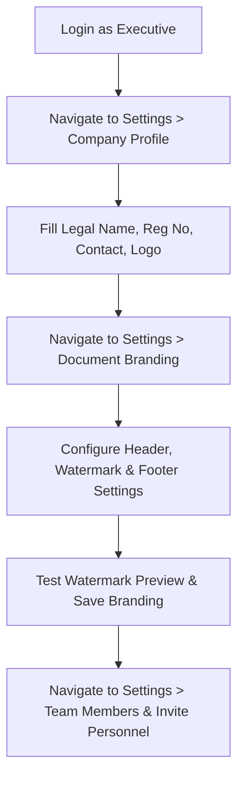
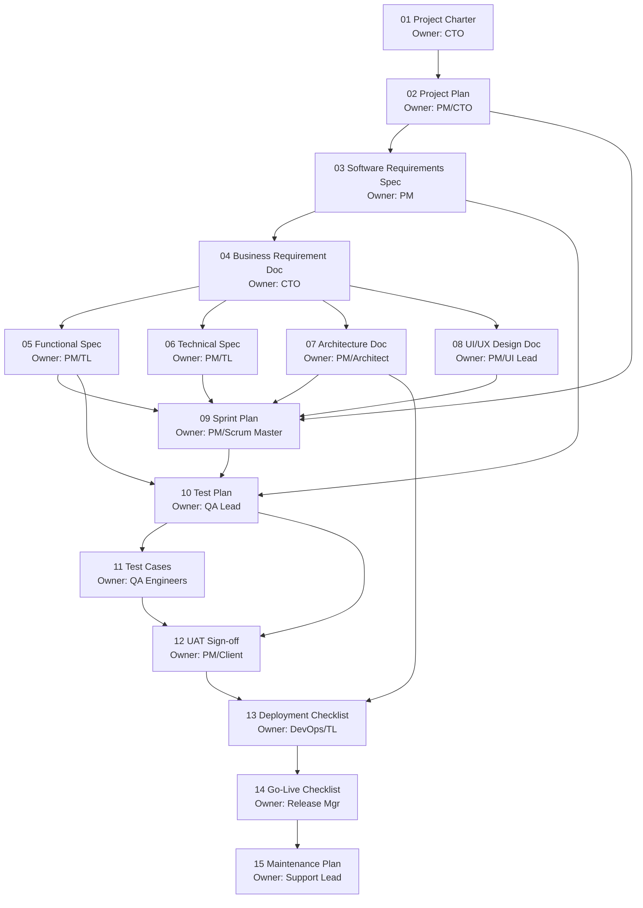
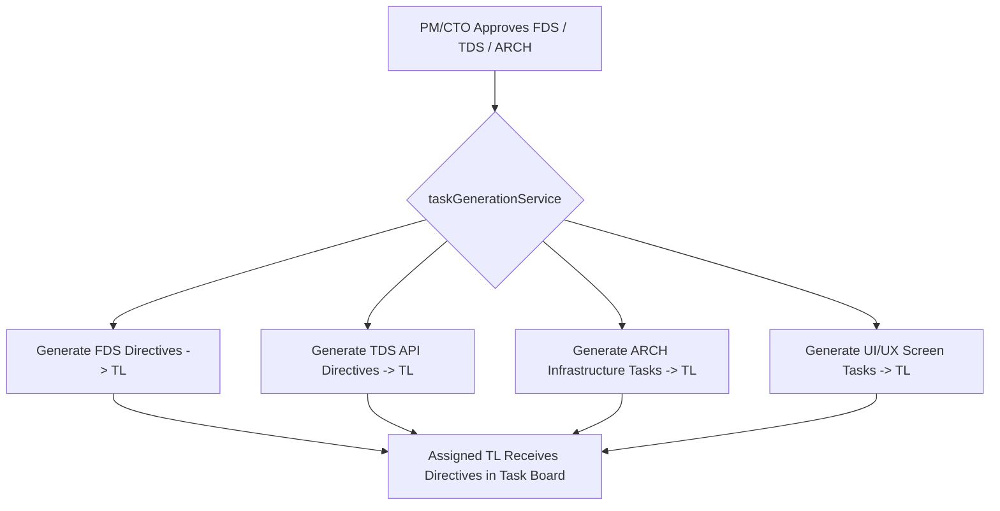
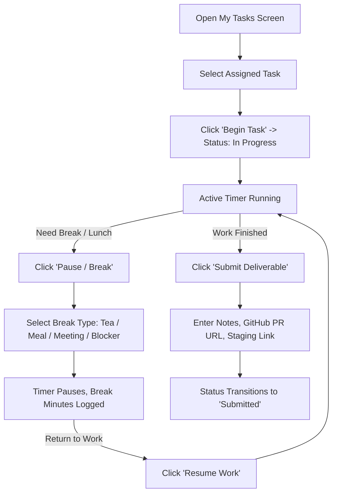
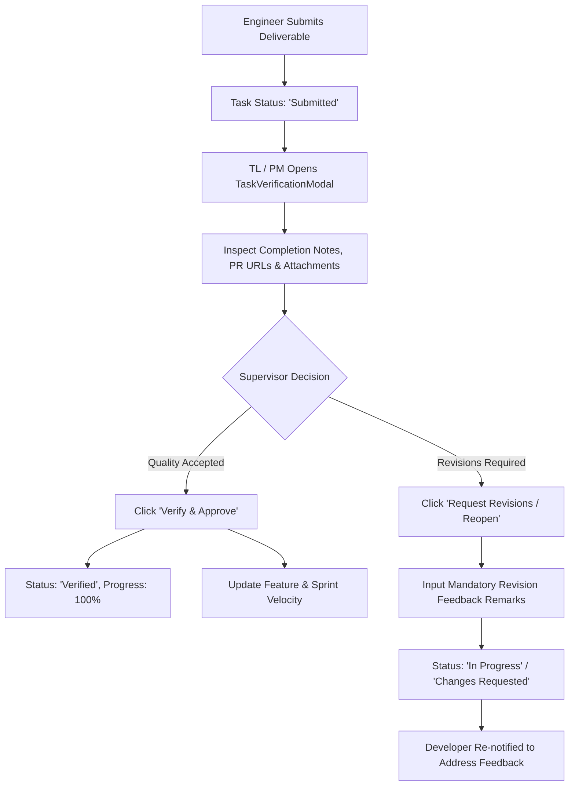

# UNAI PROJECT MANAGEMENT CRM (PM CRM)
## Standard Operating Procedure (SOP) Manual & Enterprise Governance Guide

```text
========================================================================================
DOCUMENT ID      : SOP-PMCRM-001
SYSTEM           : UNAI Project Management CRM & Paperless Document Platform
VERSION          : 2.0.0 (Enterprise Edition)
CLASSIFICATION   : Internal & Client Delivery Operational Standard
EFFECTIVE DATE   : 2026-09-01
TARGET AUDIENCE  : Executives (CEO/MD/COO/CTO/CIO), PMs, Tech Leads, QA Leads, 
                   Software Engineers, DevOps Engineers, HR Admins, and Auditors.
========================================================================================
```

---

## TABLE OF CONTENTS

1. [Executive Summary & System Purpose](#1-executive-summary--system-purpose)
2. [Core Architectural Principle & Governance Flow](#2-core-architectural-principle--governance-flow)
3. [User Roles, RBAC Governance & Permissions Matrix](#3-user-roles-rbac-governance--permissions-matrix)
4. [SOP-01: Organization Setup, Company Branding & Watermarking](#4-sop-01-organization-setup-company-branding--watermarking)
5. [SOP-02: Project Inception & Dual Onboarding Workflows](#5-sop-02-project-inception--dual-onboarding-workflows)
6. [SOP-03: 16-Stage Lifecycle Governance & Document Management](#6-sop-03-16-stage-lifecycle-governance--document-management)
7. [SOP-04: Requirements Management, Traceability & Feature Registry](#7-sop-04-requirements-management-traceability--feature-registry)
8. [SOP-05: Task Delegation, Sprint Planning & Automated Generation](#8-sop-05-task-delegation-sprint-planning--automated-generation)
9. [SOP-06: Task Execution, Micro-Time Tracking & Blocker Management](#9-sop-06-task-execution-micro-time-tracking--blocker-management)
10. [SOP-07: Quality Assurance, Test Execution & Defect Management](#10-sop-07-quality-assurance-test-execution--defect-management)
11. [SOP-08: Supervisor Verification, Reopening Loops & Sprint Closure](#11-sop-08-supervisor-verification-reopening-loops--sprint-closure)
12. [SOP-09: Project Closure, Handover & Immutable Snapshotting](#12-sop-09-project-closure-handover--immutable-snapshotting)
13. [SOP-10: Multi-Format Document Export, Portfolio Generation & Audit Trail](#13-sop-10-multi-format-document-export-portfolio-generation--audit-trail)
14. [Relational Database Schema & State Transition Reference](#14-relational-database-schema--state-transition-reference)
15. [Troubleshooting Guide & Operational FAQs](#15-troubleshooting-guide--operational-faqs)
16. [System Administration, Local Development & Deployment Runbook](#16-system-administration-local-development--deployment-runbook)

---

## 1. Executive Summary & System Purpose

The **UNAI Project Management CRM (PM CRM)** is an enterprise-grade engineering governance, paperless documentation, and project execution platform. It replaces disconnected tools (spreadsheets, chat messages, offline Word templates, ad-hoc timers) with a unified, database-backed system of record.

### Core Objectives:
1. **Zero Disconnected Documentation**: Eliminate isolated Word files by transforming all 16 engineering templates into database-driven, relational representations.
2. **End-to-End Traceability**: Guarantee strict lineage from high-level business goals down to individual line-of-code task deliverables.
3. **Rigorous Quality & Time Governance**: Enforce micro-level time logging (start/pause/break/resume), deliverable proof submission, and supervisor verification loops.
4. **Verifiable Auditability & Export**: Generate authentic, watermarked `.docx` documents and PDF portfolios dynamically populated with real, verified database records.

---

## 2. Core Architectural Principle & Governance Flow

The platform is strictly organized around a unidirectional, database-driven governance invariant:

```text
┌───────────────────────────────────────────────────────────────────────────────────┐
│                                SYSTEM PIPELINE FLOW                               │
└───────────────────────────────────────────────────────────────────────────────────┘
                                   PROJECT
                                      ↓
                              PROJECT GOVERNANCE
                                      ↓
                                DOCUMENTATION
                                      ↓
                                REQUIREMENTS
                                      ↓
                                  FEATURES
                                      ↓
                                 DIRECTIVES
                                      ↓
                                    TASKS
                                      ↓
                                  EXECUTION
                                      ↓
                                  EVIDENCE
                                      ↓
                                VERIFICATION
                                      ↓
                             ACTUAL PROJECT DATA
                                      ↓
                          DOCUMENT / REPORT GENERATION
```

### Architectural Rules:
- **No Authoritative Data Duplication**: Project parameters (dates, budgets, client names) are stored in primary tables (`projects`, `requirements`, `project_features`) and referenced or auto-populated into documents.
- **Controlled State Transitions**: Documents, features, and tasks cannot bypass stage gates. A document cannot be edited if its prerequisites in the Dependency DAG are not in an `Approved` state.
- **Immutable Mutation History**: Every status transition, document save, timer action, task verification, and role change is written to `audit_log` or `task_status_log`.

---

## 3. User Roles, RBAC Governance & Permissions Matrix

### 3.1 Role Taxonomy

The platform enforces 4 functional tiers across 8 distinct user roles:

| Tier | Role | Description & Primary Function |
| :--- | :--- | :--- |
| **Tier 1: Executive / Super Admin** | **CEO, MD, COO, CTO, CIO, HR Admin** | Full organizational authority. Manages company branding, projects, invites, role assignments, budgets, document final approvals, and project closures. |
| **Tier 2: Project Management** | **Project Manager (PM)** | Primary operational owner. Creates project plans, SRS, FDS, decomposes features, assigns directives to Tech Leads, and verifies high-level deliverables. |
| **Tier 3: Engineering Leadership** | **Team Lead (TL)** | Technical execution leader. Decomposes feature directives into granular subtasks, allocates work to developers/interns, performs code reviews, and approves task submissions. |
| **Tier 4: Execution Tier** | **Employee / Developer / Intern** | Hands-on execution. Accepts assigned tasks, runs interactive start/pause/break time tracking, uploads deliverable proofs (notes, URLs, files), and logs blockers. |

---

### 3.2 Detailed Permissions Matrix

| Platform Module / Entity | Executive (CTO/CEO/MD/CIO) | Project Manager (PM) | Team Lead (TL) | Employee / Dev |
| :--- | :---: | :---: | :---: | :---: |
| **Company Profile & Branding** | Full Control (CRUD) | Read Only | Read Only | Read Only |
| **User Invites & Role Grants** | Full Control (CRUD) | Read Only | Read Only | Read Only |
| **Create / Delete Projects** | Full Control (CRUD) | Create & Update | Read Only (Allocated) | Read Only (Allocated) |
| **Document Ingestion (.docx/.md)** | Full Control | Full Control | Read Only | No Access |
| **Edit Phase 1 Docs (Charter, Master)** | Full Control | Read Only | Read Only | Read Only |
| **Edit Phase 2 Docs (Plan, Risk)** | Full Control | Full Control | Read Only | Read Only |
| **Edit Phase 3 Docs (SRS, BRD)** | Full Control | Full Control | Read Only | Read Only |
| **Edit Phase 4 Docs (FDS, TDS, ARCH)** | Full Control | Full Control | Collaborative Edit | Read Only |
| **Edit Phase 5 Docs (Sprint, QA)** | Full Control | Full Control | Full Control | Read Only |
| **Edit Phase 6 Docs (UAT, Release)** | Full Control | Full Control | Collaborative Edit | Read Only |
| **Document Formal Sign-off (Approve)** | Full Authority | Plan/Design Docs | Collaborative Sign-off | No Authority |
| **Feature Registry Management** | Full Control | Full Control | Update Status | Read Only |
| **Task Directives (CTO/PM → TL)** | Full Control | Create & Delegate | View & Accept | Read Only |
| **Subtasks Allocation (TL → Dev)** | Full Control | Full Control | Create & Delegate | View Assigned |
| **Time Tracker (Start/Break/Resume)** | Operational | Operational | Operational | Full Interactive Use |
| **Task Deliverable Submission** | Permitted | Permitted | Permitted | Mandatory Workflow |
| **Task Verification & Close/Reopen** | Full Authority | Full Authority | Full Authority | Cannot Verify Self |
| **Sprints & Story Points Planning** | Full Control | Full Control | Full Control | View Assigned |
| **Test Cases & Executions** | Full Control | Full Control | Full Control | Execute & Log Results |
| **Bug / Defect Tracking** | Full Control | Full Control | Full Control | Log & Resolve Bugs |
| **Project Closure & Snapshots** | Full Authority | Request Closure | Read Only | Read Only |
| **DOCX / PDF / Portfolio Export** | Full Authority | Full Authority | Single Doc / Portfolio | Own Portfolio Only |
| **Audit Ledger View** | Full Global View | Project Scoped | Project Scoped | User Scoped |

---

## 4. SOP-01: Organization Setup, Company Branding & Watermarking

```text
PURPOSE   : Establish company profile, configure corporate document branding, dynamic 
            watermarks, and manage personnel access grants.
ACTORS    : CEO, MD, COO, CTO, CIO, HR Admin
FREQUENCY : On initial onboarding and upon corporate branding updates.
```



### Step-by-Step Procedure:

1. **Access Settings**: Log in as an Executive user and select the **Settings** tab on the left sidebar.
2. **Company Information Configuration**:
   - Navigate to the **Company Profile** sub-tab.
   - Enter Company Legal Name, Registration Number, Official Industry, Country, Contact Email, Phone Number, and About Summary.
   - Upload the official company logo (`.png`, `.jpg`, `.svg`). The logo will automatically be stored in Supabase Storage (`watermarks` or `avatars` bucket) and synchronized across all exported documents.
3. **Document Branding & Watermark Configuration**:
   - Navigate to the **Document Branding** sub-tab.
   - **Header Settings**:
     * Toggle `Enable Header`.
     * Set Alignment: `Left`, `Center`, `Right`, or `Split` (Company name on left, Document classification on right).
     * Set Layout: `Inline` (side-by-side) or `Stacked` (text under logo).
   - **Watermark Settings**:
     * Toggle `Enable Watermark`.
     * Choose Type: `Company Logo`, `Custom Text` (e.g., *CONFIDENTIAL*, *DRAFT*, *FINAL*), or `Uploaded Watermark Image`.
     * Configure Opacity slider: Select between `5%` (very faint) and `75%` (prominent). Recommended: `12%` - `18%`.
     * Select Orientation: `Diagonal` (-30 degree tilt) or `Horizontal` (0 degree).
   - **Footer Settings**:
     * Toggle `Enable Footer`.
     * Input Copyright Text (e.g., `© 2026 UNAI TECH PVT LTD. All Rights Reserved.`).
     * Enable `Show Page Numbering`.
     * Input Mandatory Confidentiality Notice.
4. **Personnel Invitations & Role Governance**:
   - Navigate to **Team Members** sub-tab.
   - Click **Invite User**.
   - Enter Full Name, Work Email, Department, Designation, and Assign Role (`PM`, `TL`, `Employee`, `CTO`, etc.).
   - The invited member receives credentials. Upon first login, they are prompted by the **First Time Setup Modal** to set a private password and profile avatar.

---

## 5. SOP-02: Project Inception & Dual Onboarding Workflows

```text
PURPOSE   : Initialize a new project, assign leadership, define scope, and establish the 
            16 lifecycle governance documents.
ACTORS    : CTO, PM, Executive Sponsor
FREQUENCY : Per new project engagement.
```

### Method A: Manual Project Creation (Standard Flow)

1. Navigate to **Projects Registry** and click **+ New Project**.
2. Complete the initial registration form:
   - **Project Name** & **Project Code** (e.g., `PRJ-FIN-001`).
   - **Client Name** & **Executive Sponsor**.
   - **Assigned Project Manager (PM)** & **Technical Lead (TL)**.
   - **Planned Start Date** & **Target Delivery Date**.
   - **Initial Budget** & **Department**.
   - **Executive Description & Business Objective**.
3. Click **Create Project**.
4. **Automated System Action**:
   - The system creates the `projects` record in Supabase.
   - The system automatically generates all **16 lifecycle documents** in `project_documents` in `Not Started` or `Draft` status.
   - Initial project members are allocated in `project_members`.
   - An immutable audit log entry is written to `audit_log`.

---

### Method B: Intelligent Document Ingestion (.docx / .md / .txt Auto-Provisioning)

1. Open the project and launch the **Project Onboarding Panel** or click **Ingest Project Spec (.docx / .md)**.
2. Select and upload the engineering specification document (e.g., `01_Project_Charter.docx` or `Full_Project_Spec.md`).
3. **Automated Ingestion Engine (`documentIngestionService.ts`)**:
   - **Mammoth Engine** extracts raw structured text, headings, and tables.
   - **Regex & Pattern Extractors** parse:
     * Project Code, Client, Sponsor, Start/End Dates, Budget.
     * Technical Stack: Frontend, Backend, Database, Cloud Infrastructure, Security protocols.
     * Feature Modules: Module names, descriptions, estimated hours, and priorities.
     * Lifecycle Milestones: Phases, deliverables, target dates.
     * Quality & QA Strategy: Scope, acceptance criteria, UAT turnaround days.
     * Deployment & SLA: CI/CD pipeline, rollback procedures, uptime SLA.
4. **Review & Auto-Provision**:
   - Inspect the extracted preview in the 4-step wizard.
   - Modify any parsed fields if necessary.
   - Click **Complete Onboarding & Auto-Provision Documents**.
   - The system populates all 16 project documents with structured JSONB content and sets up features in `project_features`.

---

## 6. SOP-03: 16-Stage Lifecycle Governance & Document Management

```text
PURPOSE   : Govern the authoring, auto-filling, versioning, review, and approval of 
            the 16 standardized project lifecycle documents.
ACTORS    : CTO, PM, Tech Leads, QA Leads, DevOps, Support Leads
FREQUENCY : Continuously throughout project execution.
```

### 6.1 The 16 Lifecycle Documents Catalog

```text
┌───────────────────────────────────────────────────────────────────────────────────────────────────────────┐
│                                     6 PHASES & 16 LIFECYCLE TEMPLATES                                     │
├──────────────┬──────────────────┬─────────────────┬──────────────────┬─────────────────┬──────────────────┤
│ 1. INITIATE  │ 2. PLAN          │ 3. REQUIREMENTS │ 4. DESIGN        │ 5. EXECUTION    │ 6. HANDOVER      │
├──────────────┼──────────────────┼─────────────────┼──────────────────┼─────────────────┼──────────────────┤
│ #00 Master   │ #02 Project Plan │ #03 SRS         │ #05 Functional   │ #09 Sprint Plan │ #12 UAT Sign-off │
│     Record   │ #03 Team Matrix  │ #04 BRD         │     Specification│ #10 Test Plan   │ #13 Deployment   │
│ #01 Project  │ #04 Risk Strategy│                 │ #06 Tech Spec    │ #11 Test Cases  │     Checklist    │
│     Charter  │                  │                 │ #07 Architecture │                 │ #14 Go-Live      │
│              │                  │                 │ #08 UI/UX Spec   │                 │ #15 Maintenance  │
└──────────────┴──────────────────┴─────────────────┴──────────────────┴─────────────────┴──────────────────┘
```

| # | Document Template Name | Phase | Primary Owner | Mandatory Dependencies | Task Auto-Gen? |
| :---: | :--- | :--- | :--- | :--- | :---: |
| **0** | **Master Record** | All Phases | CTO / Executive | None | No |
| **1** | **Project Charter** | Initiate | CTO / Sponsor | None (Inception Doc) | No |
| **2** | **Project Management Plan** | Plan | PM / CTO | Requires #1 (Charter) Approved | No |
| **3** | **Software Requirements Spec (SRS)** | Requirements | PM / Lead BA | Requires #1, #2 Approved | No |
| **4** | **Business Requirement Doc (BRD)** | Requirements | CTO / PM | Requires #1, #2, #3 Approved | No |
| **5** | **Functional Specification (FDS)** | Design | PM / Tech Lead | Requires #1, #2, #3, #4 Approved | **YES (TL Tasks)** |
| **6** | **Technical Specification (TDS)** | Design | PM / Tech Lead | Requires #1, #2, #3, #4 Approved | **YES (API Tasks)** |
| **7** | **Architecture Design Doc (ARCH)** | Design | PM / Architect | Requires #1, #2, #3, #4 Approved | **YES (Infra Tasks)**|
| **8** | **UI/UX Design Document** | Design | PM / UI Lead | Requires #1, #2, #3, #4 Approved | **YES (UI Tasks)** |
| **9** | **Sprint Execution Plan** | Build | PM / Scrum Master| Requires #2, #5, #6, #7, #8 Approved | No |
| **10**| **Test Plan** | Test | QA Lead / PM | Requires #3, #5, #9 Approved | No |
| **11**| **Test Cases Specification** | Test | QA Engineer / PM | Requires #10 Approved | No |
| **12**| **User Acceptance Test (UAT)** | Test | PM / Client Lead | Requires #10, #11 Approved | No |
| **13**| **Deployment Checklist** | Release | DevOps / Tech Lead| Requires #7, #12 Approved | No |
| **14**| **Go-Live Checklist** | Release | DevOps / Release PM| Requires #13 Approved | No |
| **15**| **Maintenance & Support Plan** | Maintain | Support Lead / PM | Requires #14 Approved | No |

---

### 6.2 Directed Acyclic Graph (DAG) Dependency Enforcement



### 6.3 Document Life Cycle States & Gate Enforcement

1. **Readiness Check**: When an author attempts to open a document in **DocumentEditScreen**, the system evaluates `isDocumentEditable(templateId, role, documents)`:
   - If any prerequisite document is NOT `Approved`, editing is blocked.
   - The UI renders the **DocReadinessGate** banner displaying exact unapproved predecessor documents.
2. **Completion Requests**: If blocked, the user can click **Send Completion Request** to notify the predecessor document owner.
3. **Upstream Auto-Fill**:
   - Upon opening an unblocked document, `getAutoFillContent()` automatically pulls approved data from predecessor documents (e.g., FDS pulls use cases from SRS; Architecture doc pulls database notes from TDS).
4. **Editing & Snapshot Versioning**:
   - The form renders structured input fields, rich textareas, tags, and multi-column tables.
   - Saving creates an immutable snapshot in `document_versions` and updates `project_documents.completion`.
5. **Formal Approval Workflow**:
   - Authorized roles (CTO/PM) review the completed document in **DocumentDetailScreen**.
   - Clicking **Approve Document** prompts for approval remarks.
   - Status changes to `Approved`, triggering automated downstream task generation if `taskGeneratable = true`.

---

## 7. SOP-04: Requirements Management, Traceability & Feature Registry

```text
PURPOSE   : Capture, version, and trace requirements through features, directives, 
            tasks, test cases, and bug logs.
ACTORS    : PM, System Architect, Tech Lead
FREQUENCY : During Requirements and Design phases, and upon Change Requests.
```

### 7.1 Requirements Decomposition & Code Assignment
- Requirements are created in `requirements` table with unique standardized codes (e.g., `REQ-AUTH-001`, `REQ-BILL-002`).
- Each requirement is classified by type: `Business`, `Functional`, `Non-Functional`, `Technical`, `UX`, `Security`, or `Compliance`.
- Acceptance criteria and source document references are mandatory.

### 7.2 Feature Architecture Registry (`project_features`)
- The PM/Tech Lead breaks down the architecture into discrete modules in **FeatureArchitectureTree**:
  * Feature Name & Description.
  * Target Technology Stack.
  * Linked Functions, APIs, and Screen IDs.
  * Assigned Technical Lead (TL).
  * Sequence Order & Dependency Flags (`isBlocked`).

### 7.3 Sequential Pipeline Unlocking
- Features unlock sequentially: Feature 2 remains locked until Feature 1 reaches `Verified` status by the Project Manager.

---

## 8. SOP-05: Task Delegation, Sprint Planning & Automated Generation

```text
PURPOSE   : Transform approved specifications and features into actionable directives 
            and granular developer subtasks.
ACTORS    : CTO, PM, Tech Lead, Developers
FREQUENCY : At sprint planning and upon document approvals.
```

### 8.1 Automated Task Generation Pipeline

When Design Documents (FDS #5, TDS #6, ARCH #7, UI/UX #8) are marked `Approved`, `taskGenerationService.ts` triggers automated generation:



### 8.2 Hierarchical Task Delegation

The platform enforces a 3-level delegation hierarchy:

```text
Level 1: [CTO_TO_PM]   — Executive directives assigned to Project Managers.
Level 2: [PM_TO_TL]     — Feature architecture directives assigned to Technical Leads.
Level 3: [TL_TO_DEV]    — Granular implementation subtasks assigned to Developers/Interns.
```

1. **PM Delegation to TL**: PM opens the **TaskAssignmentModal**, sets `hierarchyLevel = PM_TO_TL`, selects the parent Feature, specifies estimated hours, and assigns the Tech Lead.
2. **TL Breakdown to Dev**: Tech Lead selects the directive task, clicks **+ Add Subtask**, sets `hierarchyLevel = TL_TO_DEV`, attaches reference mockups/APIs, and assigns the specific Developer.

---

## 9. SOP-06: Task Execution, Micro-Time Tracking & Blocker Management

```text
PURPOSE   : Guide engineers through task acceptance, start/pause/break time logging, 
            blocker reporting, and deliverable submission.
ACTORS    : Software Engineers, Developers, Interns
FREQUENCY : Daily during sprint execution.
```

### 9.1 The Developer Daily Execution Loop



### 9.2 Micro-Level Time Tracker Operations

The **TaskTimeTracker** component manages precise productivity tracking:
- **`Begin Task`**: Changes status to `In Progress`. Writes `begin` record to `task_time_logs` with current UTC timestamp.
- **`Pause / Break`**: Displays the Break Modal with 4 standardized options:
  1. `Tea / Coffee Break`
  2. `Meal / Lunch Break`
  3. `Internal / Client Meeting`
  4. `Technical Blocker / Investigation`
- **`Resume Work`**: Ends break interval, calculates total break minutes, and resumes productivity timer.
- **Overdue Indicator**: If elapsed work time exceeds `estimated_hours` or passes the `due_date`, the timer widget displays an amber/red overdue warning badge.

### 9.3 Blocker Reporting & Escalation
- If an engineer is blocked (e.g., missing API, third-party outage, access denial), they click **Report Blocker**.
- They select Severity (`Low`, `Medium`, `High`, `Critical`), input blocker rationale, and link the affected Task/Feature.
- Task status changes to `Blocked`. The PM and TL dashboards immediately display the blocker for resolution.

---

## 10. SOP-07: Quality Assurance, Test Execution & Defect Management

```text
PURPOSE   : Manage test plan validation, test case execution, and defect lifecycles.
ACTORS    : QA Leads, QA Engineers, Developers, PM
FREQUENCY : During Test phase and continuous sprint QA.
```

### 10.1 Test Case Management (`test_cases`)
1. QA Engineers create test cases mapped to specific **Requirement Codes** (`requirement_id`) and **Feature IDs** (`feature_id`).
2. Define Preconditions, Step-by-Step Actions, Expected Results, and Priority (`High`, `Medium`, `Low`).

### 10.2 Test Execution (`test_executions`)
1. QA runs the test suite against the target environment (`Staging`, `UAT`, `Production`).
2. Log Test Execution: Mark status as `Passed`, `Failed`, `Blocked`, or `Skipped`.
3. If `Failed`, the QA engineer clicks **Create Defect from Failure**.

### 10.3 Bug / Defect Lifecycle (`bugs`)
- **Bug Creation**: Capture Bug Code (e.g., `BUG-SEC-004`), Title, Severity (`Critical`, `High`, `Medium`, `Low`), Steps to Reproduce, and assign to responsible Developer.
- **Resolution**: Developer fixes code, submits PR, logs resolution notes, and transitions status to `Resolved`.
- **QA Verification**: QA re-tests. If verified, status becomes `Verified` → `Closed`. If defective, status is `Reopened`.

---

## 11. SOP-08: Supervisor Verification, Reopening Loops & Sprint Closure

```text
PURPOSE   : Verify submitted deliverables, award story points, manage revisions, 
            and formally close sprints.
ACTORS    : Tech Lead (TL), Project Manager (PM)
FREQUENCY : As deliverables are submitted and at sprint ends.
```

### 11.1 Verification & Approval Workflow



### 11.2 Revision & Reopening Rules
- Supervisors **CANNOT** reject a task without providing clear written feedback remarks.
- Remarks are permanently appended to `task_status_log` with the supervisor's name, role, and timestamp.

### 11.3 Sprint Closure Procedure
1. At the end of the sprint cycle, the PM navigates to the **Sprint Plan** module.
2. Review Sprint Velocity: Planned Capacity vs. Completed Story Points vs. Actual Hours Logged.
3. Unfinished tasks are reviewed: Select `Carry Forward to Next Sprint` with documented justification.
4. Click **Close Sprint**. The system creates an immutable `sprint_snapshots` record.

---

## 12. SOP-09: Project Closure, Handover & Immutable Snapshotting

```text
PURPOSE   : Validate project readiness, execute final client sign-off, create immutable 
            project baseline snapshots, and archive the project.
ACTORS    : CTO, PM, Client Sponsor
FREQUENCY : Upon project completion.
```

### 12.1 Pre-Closure Readiness Gates

Before a project can be transitioned to `Completed`, `projectClosureService.ts` validates the following 5 gates:

```text
[GATE 1] : All 16 Lifecycle Documents must have status = 'Approved'.
[GATE 2] : 100% of all assigned Tasks must have status = 'Verified' or 'Closed'.
[GATE 3] : Zero unresolved Critical or High Severity Blockers.
[GATE 4] : 100% UAT Test Cases marked 'Passed' with Client Sign-off (#12).
[GATE 5] : Project Handover Document (#16) signed with warranty terms defined.
```

### 12.2 Snapshot Generation & Archival
1. Once all gates pass, the CTO clicks **Execute Formal Project Closure**.
2. **System Action**:
   - Compiles full database state into a consolidated JSON payload.
   - Stores immutable record in `project_snapshots` with `snapshot_type = 'Project Closure'`.
   - Transitions `projects.status` to `Completed` and sets `actual_end_date`.
   - Locks all project documents from further edits.

---

## 13. SOP-10: Multi-Format Document Export, Portfolio Generation & Audit Trail

```text
PURPOSE   : Generate branded Microsoft Word (.docx) documents, PDF portfolios, 
            individual employee execution resumes, and maintain audit records.
ACTORS    : All authenticated roles (scoped by RBAC)
FREQUENCY : On-demand and at governance milestone reviews.
```

### 13.1 Microsoft Word (.docx) Export Engine

- Exported via `exportService.exportToDocx(doc, branding, orgName, tasks)`:
  * **Document Title & Classification**: Formatted brand blue headers.
  * **Document Control Table**: 6-column revision history table (Version, Date, Prepared By, Reviewed By, Approved By, Description).
  * **Dynamic Content Population**: Injects actual project fields, tables, requirements, milestones, and signatures.
  * **Headers & Footers**: Dynamic company watermark, copyright, and confidentiality notices.

### 13.2 High-Resolution PDF & Print Generation

- Formatted using clean print CSS:
  * Injects CSS background watermark with calculated opacity and orientation.
  * Standardized page margins (0.75 in), page breaks before major headers, and crisp typography.

### 13.3 Individual Member Portfolio PDF Export

- Exported via `exportService.exportMemberPortfolioPdf(member, tasks, timeLogs, documents, orgName, branding)`:
  * **Header**: Employee Name, Designation, Department, Employee Code, Avatar.
  * **KPI Scorecard**: Total Work Logged, Break Downtime, Completed Tasks, Verified Story Points.
  * **Itemized Task Execution Table**: Every task worked on, time spent, deliverables submitted.
  * **Authored Documents Table**: Documents filled or reviewed by the member.
  * **Supervisor Review Log**: Feedback remarks received from TL/PM.
  * **Executive Verification & Signature Block**.

### 13.4 Audit Trail & Compliance Ledger

- Every mutation triggers `auditService.logAction()`:
  * Actor ID, Actor Name, Actor Role.
  * Action Type (e.g., `DOCUMENT_APPROVED`, `TASK_VERIFIED`, `BRANDING_UPDATED`).
  * Entity Type & Entity ID.
  * Metadata Details and Timestamp.
- Accessible under the **Audit Trail** screen with real-time search, filtering, and export.

---

## 14. Relational Database Schema & State Transition Reference

```text
┌─────────────────────────────────────────────────────────────────────────────────────────┐
│                               RELATIONAL SCHEMA TOPOLOGY                                │
└─────────────────────────────────────────────────────────────────────────────────────────┘

   organizations (1) ────< (N) organization_members
         │
         ├────────────────< (N) projects (1) ────< (N) project_members
         │                         │
         │                         ├─────────────< (N) project_features (1) ──< (N) tasks
         │                         │
         │                         ├─────────────< (N) project_documents (1) ─< (N) document_versions
         │                         │                         │
         │                         │                         └─────────< (N) document_approvals
         │                         │
         │                         ├─────────────< (N) requirements (1) ──────< (N) requirement_tasks
         │                         │
         │                         ├─────────────< (N) sprints (1) ───────────< (N) sprint_tasks
         │                         │
         │                         ├─────────────< (N) test_cases (1) ────────< (N) test_executions
         │                         │
         │                         ├─────────────< (N) bugs
         │                         │
         │                         └─────────────< (N) project_snapshots
         │
         └────────────────< (N) audit_log
```

### 14.1 State Machine Lifecycle Diagrams

#### Document Status State Machine:
```text
[Not Started] ──▶ [Draft] ──▶ [In Progress] ──▶ [Ready for Review] ──▶ [Under Review]
                                                        │                     │
                                                        ▼                     ▼
                                              [Changes Requested] ◀───────────┤
                                                        │                     │
                                                        ▼                     ▼
                                                   [Approved] ───────▶ [Locked / Archived]
```

#### Task Status State Machine:
```text
[Open] ──▶ [Assigned] ──▶ [Accepted] ──▶ [In Progress] ──▶ [Submitted] ──▶ [Verified] ──▶ [Closed]
                                 │              │               │
                                 ▼              ▼               ▼
                             [Blocked]    [Overdue Warn]   [Changes Requested / Reopened]
                                 │                              │
                                 └────────▶ [Resume] ◀──────────┘
```

---

## 15. Troubleshooting Guide & Operational FAQs

### FAQ 1: "Why is a document locked with 'Prerequisite documents must be approved'?"
- **Cause**: The Document Dependency DAG requires all upstream predecessor documents to be in `Approved` status.
- **Resolution**: Open the predecessor document listed in the **DocReadinessGate** banner and ensure the designated reviewer has executed formal approval.

### FAQ 2: "Why am I seeing 'Access Denied: No active role grant for PM CRM' on login?"
- **Cause**: The user exists in Supabase Auth, but no active record exists in `onboarding_role_grants` with `crm_name = 'pm_crm'` and `is_active = true`.
- **Resolution**: An Executive or HR Admin must grant the user a role under **Settings > Team Members**.

### FAQ 3: "The Task Timer was left running overnight. How do I fix the logged hours?"
- **Cause**: User forgot to pause or submit task at end of shift.
- **Resolution**: The assigned Tech Lead or PM can open the **Task Detail Modal**, adjust the actual hours, and append an audit note explaining the manual adjustment.

---

## 16. System Administration, Local Development & Deployment Runbook

### 16.1 Prerequisites
- Node.js `v18.x` or `v20.x` LTS
- npm `v9.x` or higher
- Supabase Project with PostgreSQL 15

### 16.2 Environment Configuration (`.env`)
```env
# Central Onboarding Platform / Supabase Project
VITE_SUPABASE_URL=https://your-supabase-project.supabase.co
VITE_SUPABASE_ANON_KEY=eyJhbGciOiJIUzI1NiIsInR5cCI6IkpXVCJ9...
VITE_CRM_NAME=pm_crm
```

### 16.3 Local Development Commands
```bash
# 1. Install dependencies
npm install

# 2. Start Vite Web App (Browser Mode)
npm run dev

# 3. Start Electron Desktop Application
npm run electron:dev

# 4. Build Production Web Bundle
npm run build

# 5. Build Desktop Executable (Windows/macOS/Linux)
npm run electron:build
```

---

```text
========================================================================================
                      END OF STANDARD OPERATING PROCEDURE MANUAL
                       UNAI TECH PVT LTD — ALL RIGHTS RESERVED
========================================================================================
```
